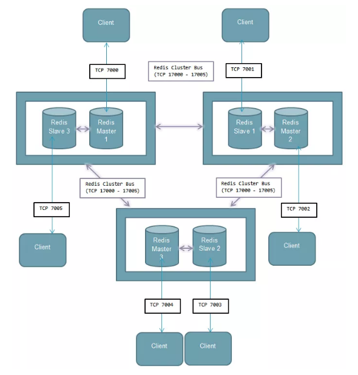
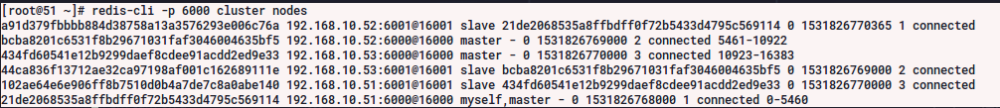
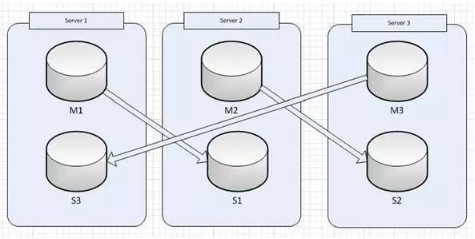
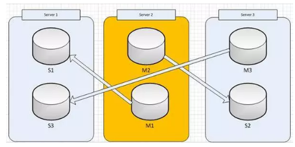

### Run ansible
   ansible-playbook -i inventory/redis/inventory.cfg redis_cluster.yml -u root --tags=install

# Redis cluster topology
Yêu cầu tối thiểu 3 node

note:

<id> <ip:port> <flags> <master> <ping-sent> <pong-recv> <config-epoch> <link-state> <slot> <slot> ... <slot>

### Add node
    redis-trib.rb add-node <ip>:<port>
### Add Salve
    redis-trib.rb add-node --slave --master-id <master_id> <ip.slave>:<port> <ip.master>:<port>

### Removing a node
    redis-trib del-node <ip>:<port> <node-id>

## Thao tác khi 1 node die

Khi master trong cặp master slave bị die, slave sẽ được đẩy lên làm master. Khi master old sống lại nó sẽ làm slave của master hiện tại.

- Hệ thống ban đầu

- Hệ thống khi 1 node die

Cần tái lập lại hệ thống ban đầu bằng cách restart redis sau khi node die hoạt động trở lại.

test1
test2
